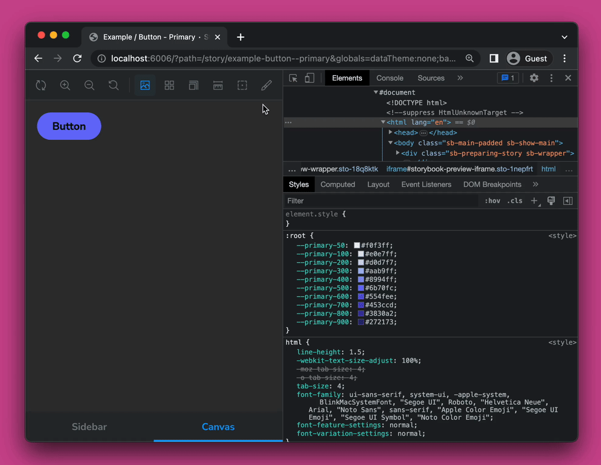

<div align="center">
  <h1>Storybook Addon Data Theme Switcher</h1>
</div>

<div align="center">
  <p>A lightweight Storybook addon to switch data-theme attribute</p>
</div>

<div align="center">

<a href="https://github.com/paulbuechner/storybook-addon-data-theme-switcher">

</a>
<a href="https://www.npmjs.com/package/storybook-addon-data-theme-switcher">

</a>
<a href="https://www.npmjs.com/package/storybook-addon-data-theme-switcher">

</a>

</div>

<br/>

<div style="width: 100%;">
  
</div>

<br/>

This Addon lets you switch the `data-theme` attribute in your Storybook, by
selecting a defined theme from a toolbar dropdown and adding the selected theme
to the `data-theme` attribute of storybooks iframe html element.

This comes in handy if you want to test your components with different themes.

## Compatibility

This addon is compatible with storybook version `^7.0.x`.

## Installation

```shell
npm install storybook-addon-data-theme-switcher --save-dev
```

## Getting Started

Then activate the addon by adding it to the storybook `main.js` file 
(located in the Storybook config directory):

```javascript
module.exports = {
  addons: [
    // other addons here
    "storybook-addon-data-theme-switcher",
  ],
};
```

## Configuration

The addon makes use of storybooks `globalTypes` to define and load the themes.

To define a selection of themes alongside other configuration options, you can 
add the following to your global storybook configuration file `preview.js`:

```typescript
import type { ThemeConfig } from "storybook-addon-data-theme-switcher";

export const globalTypes = {
  dataThemes: {
    defaultValue: {
      list: [
        { name: "Rainforest", dataTheme: "rainforest", color: "#00755e" },
        { name: "Candy", dataTheme: "candy", color: "#ffb7d5" },
        { name: "Rose", dataTheme: "rose", color: "#ff007f" },
      ],
      dataAttribute: "data-theme", // optional (default: "data-theme")
      clearable: true,             // optional (default: true)
      toolbar: {
        title: "Change data-theme attribute", // optional
        icon: "paintbrush",                   // optional
      },
    } satisfies ThemeConfig,
  },
};
```

To set a default `data-theme` value, which will be used in the initial load of
the storybook, you can add the following to your `preview.js` file:

```javascript
export const globalTypes = {
  dataTheme: {
    defaultValue: "rainforest",
  },
  dataThemes: {
    ...
  },
};
```

> **Note:** Make sure to match the `dataTheme` default value with one of the
> defined themes in the `list` array.

# License

This project is licensed under the [MIT License](LICENSE)
